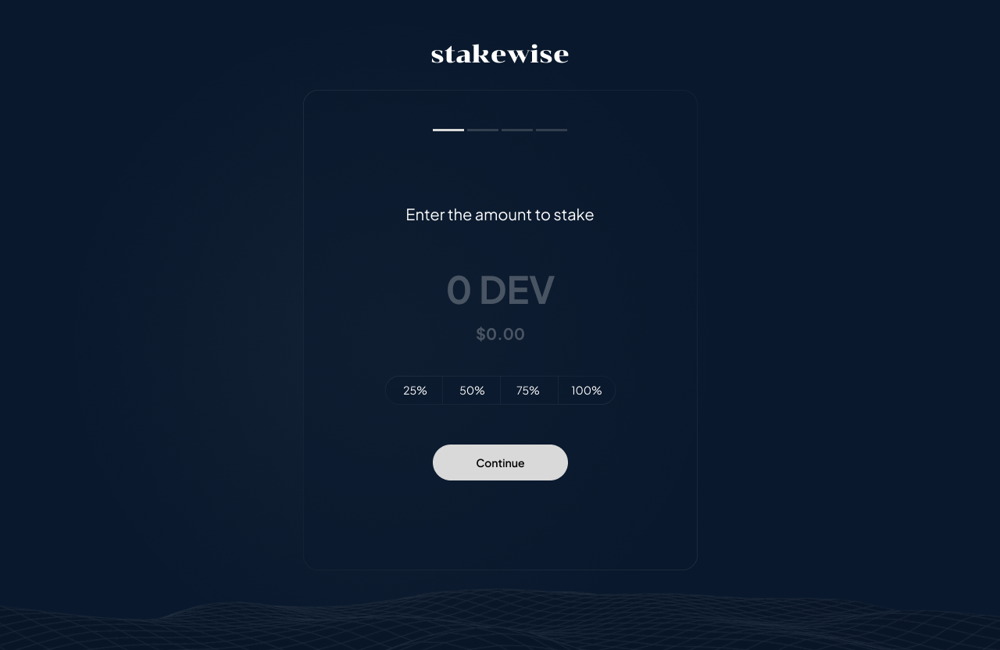

# StakeWise

Stakewise is an Moonbeam-native staking application that allows users to seamlessly balance their stake across collators on Moonbeam based on their personalized preferences. This project was built for the Bear Necessities Hackathon hosted by the Moonbeam Foundation and HackerEarth.

## Problem Statement
Moonbeam Network has its decentralized security and operations facilitated by collators. These collators are responsible for producing blocks and aiding in block liveness, thereby playing a critical role in network liveness, decentralization, and security. However, the delegation process isn't without its challenges. One such challenge is that delegating all tokens to a single collator can carry inherent risks, such as potential lack of block production due to unforeseen circumstances, leading to non-receipt of rewards. Furthermore, choosing a single collator implies that the delegator's reward yield is tied to the performance and reliability of just one collator, making it a high-stakes decision.

The need, therefore, is for token holders to diversify their stake across multiple collators to mitigate risks and ensure a steady stream of rewards. This diversification approach parallels traditional investment strategies, which promote spreading investments across different assets to manage risk effectively. Yet, implementing this strategy is not straightforward. Selecting multiple collators for delegation demands an understanding of various factors for each collator, like self-bonded tokens, effective amount bonded, number of delegations, minimum bond, and blocks produced per round. Further complicating the process is the constant flux within these variables, necessitating regular review and adjustment of delegated stakes.

The problem, therefore, is to develop an efficient, intuitive, and user-friendly platform to assist token holders in spreading their stake across multiple collators. This method should help users understand the dynamics of multiple collators, navigate the complexities of the Moonbeam delegation process, and make informed decisions to optimize their risk-reward balance.

## Overview

StakeWise is a practical tool that facilitates seamless batch staking operations on the Moonbeam network. The platform consists of two core components: the `MultiStaker` smart contract and the staking dapp. These tools work in tandem to allow users to easily delegate their tokens across multiple collators according to their preferences.

## What It Does

StakeWise offers a streamlined approach to token staking on the Moonbeam network. By making the process of staking tokens, managing delegations, and withdrawing rewards straightforward and intuitive, StakeWise can serve as a beneficial tool for both novice and experienced stakeholders.

## Features

StakeWise provides a wealth of features to ensure a comprehensive and user-friendly experience:

- **Flexible Staking**: StakeWise allows users to balance their stake across multiple collators, reducing the risk of staking on a single collator and potentially increasing staking rewards.

- **Dynamic Collator Selection**: StakeWise offers users the flexibility to select collators based on a range of criteria including their APY, min bond,number of unique accounts that have delegated to this collator, and blocks per round.

- **Manage Stakes**: StakeWise provides the functionality to redelegate tokens from one collator to another, unstake tokens, and withdraw rewards, allowing users to adapt their staking strategy as needed.

- **Fetch and Display Collator Data**: StakeWise fetches and displays relevant data about collators and the user's delegations.

## Utilizing Moonbeam Precompiles
The StakeWise platform extensively utilizes Moonbeam's Staking Precompile contract (i.e. `StakingInterface.sol`), allowing the platform to perform staking transactions and interact with core runtime functionalities on the Moonbeam Network. These precompiles behave like smart contracts within the EVM, enabling smart contracts to communicate with and leverage the core protocol's functionalities, such as staking and voting operations.

## Tech Stack

The StakeWise platform comprises two main components: 

- **MultiStaker**: A Solidity smart contract built for the Moonbeam network. It provides a comprehensive toolkit for managing stake-related transactions.

- **Delegator Application**: A front-end application that provides an intuitive interface for managing delegations on the Moonbeam Testnet, built with: Chakra UI, RainbowKit, Wagmi Hooks, Ethers.js, Next.js, and Vercel.

## How It Operates

At a high level, StakeWise operates by interfacing with the Moonbeam network via the MultiStaker smart contract, which uses Moonbeam Precompiles (`StakingInterface.sol`) to interact with the core protocol functionalities. The contract manages approvals for various transactions, handles the distribution of rewards, and provides the user with view functions to check various pieces of data related to their stakes.

The staking dapp provides a front-end interface where users can manage their tokens, select collators, and delegate their tokens. It interacts with the MultiStaker contract and Moonbeam Precompiles to facilitate these operations and fetch relevant data.

The integration of these two components makes StakeWise a comprehensive tool for managing staking operations on the Moonbeam network, while fully leveraging the power and flexibility of Moonbeam Precompiles.

